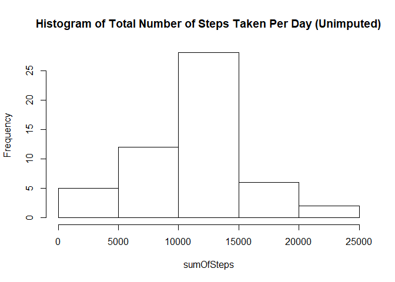
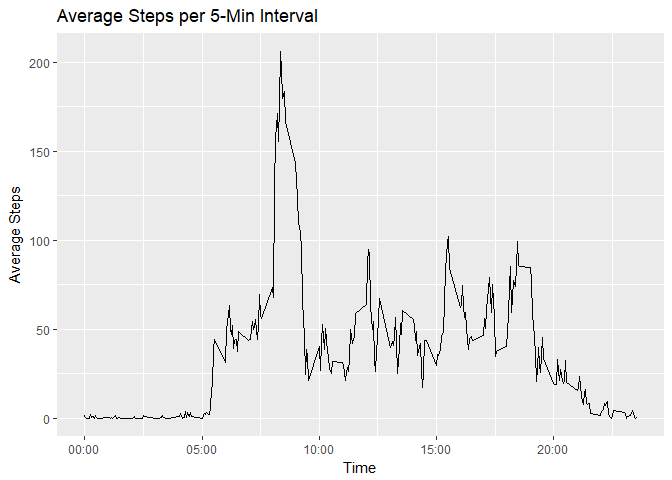
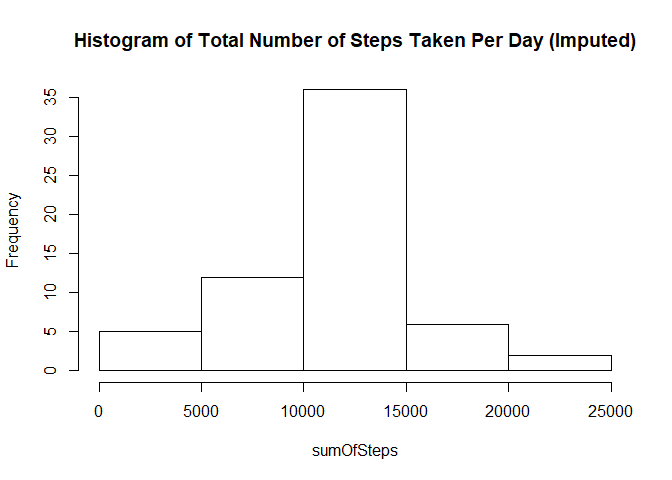
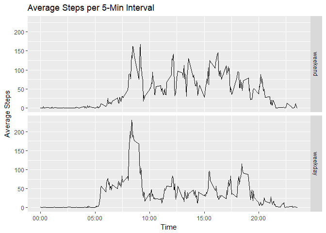

## Loading and preprocessing the data

```r
if (!file.exists("./data")) {
    dir.create("./data")
}

unzippedFile <- unzip("activity.zip", exdir = "./data")

activity <- read.csv(unzippedFile, header = TRUE, sep = ",", stringsAsFactors = 
                             FALSE, na.strings = "NA", dec = ".")
```


## What is mean total number of steps taken per day?

```r
sumSteps <- data.frame(sumOfSteps = with(activity, tapply(steps, date, sum)))


with(sumSteps, hist(sumOfSteps,
                    main = "Histogram of Total Number of Steps Taken Per Day (Unimputed)"))
```

<!-- -->

```r
meanTotalSteps <- mean(sumSteps[[1]], na.rm = TRUE)
medianTotalSteps <- median(sumSteps[[1]], na.rm = TRUE)
```

The mean total number of steps taken a day is 10766.19, and the median is 10765.


## What is the average daily activity pattern?

```r
library(ggplot2)
library(dplyr)
```

```
## 
## Attaching package: 'dplyr'
```

```
## The following objects are masked from 'package:stats':
## 
##     filter, lag
```

```
## The following objects are masked from 'package:base':
## 
##     intersect, setdiff, setequal, union
```

```r
library(reshape2)

timeHHMM_formatter <- function(x){
        h <- x %/% 100
        m <- x %% 100
        lab <- sprintf("%02d:%02d", h, m)
}

avgSteps <- data.frame(avgOfSteps = with(activity, tapply(steps, interval, mean, na.rm = TRUE)))
ggplot(data = avgSteps, aes(x = as.numeric(row.names(avgSteps)),
                            y = avgSteps[[1]])) +
        geom_line() +
        ggtitle("Average Steps per 5-Min Interval") +
        labs(x = "Time", y = "Average Steps") +
        scale_x_continuous(labels = timeHHMM_formatter)
```

<!-- -->

```r
maxStepsInterval <- timeHHMM_formatter(as.numeric(row.names(avgSteps)[which.max(avgSteps[[1]])]))
```

The 5-minute interval beginning at 08:35 (24-hour format) contains the maximum number of steps per day.


## Imputing missing values

```r
numMissing <- sum(is.na(activity$steps))
```

There are 2304 observations missing in the dataset. We will fill in the missing data with the mean for that 5-minute interval.


```r
avgSteps$interval <- row.names(avgSteps)

activityFull <- merge(activity, avgSteps,
                      by = "interval",
                      all.x = TRUE)
naFilter <- is.na(activityFull$steps)
activityFull[naFilter, 2] <- activityFull[naFilter, 4]
activityFull <- activityFull[with(activityFull, order(date, interval)), c(2, 3, 1)]

sumStepsFull <- data.frame(sumOfSteps = with(activityFull, tapply(steps, date, sum)))

with(sumStepsFull, hist(sumOfSteps,
                        main = "Histogram of Total Number of Steps Taken Per Day (Imputed)"))
```

<!-- -->

```r
meanTotalStepsFull <- mean(sumStepsFull[[1]])
medianTotalStepsFull <- median(sumStepsFull[[1]])
```

The mean total number of steps taken a day is 10766.19, and the median is 10766.19. The mean is unchanged, though the median differs slightly than in the first part of the assignment. Imputing the missing data has minimal impact on these estimates for the total number of steps taken per day.

## Are there differences in activity patterns between weekdays and weekends?


```r
activityFull$DayOfWeek <- weekdays(as.Date(activityFull$date), abbreviate = TRUE)
dayOfWeekLabels <- unique(activityFull$DayOfWeek)
weekdayLabels <- dayOfWeekLabels[1:5]
weekendLabels <- dayOfWeekLabels[6:7]
activityFull$Weekday <- activityFull$DayOfWeek %in% weekdayLabels
activityFull$WeekdayFactor <- factor(activityFull$Weekday, labels = c("weekend", "weekday"))


avgStepsFull <- data.frame(avgOfSteps = with(activityFull, tapply(steps, list(interval, WeekdayFactor), mean)))

avgStepsFull$interval <- row.names(avgStepsFull)
avgStepsFullPlot <- melt(avgStepsFull)
```

```
## Using interval as id variables
```

```r
levels(avgStepsFullPlot$variable) <- c("weekend", "weekday")


ggplot(data = avgStepsFullPlot, aes(x = as.numeric(interval),
                            y = value)) +
        geom_line() +
        facet_grid(variable~.) +
        ggtitle("Average Steps per 5-Min Interval") +
        labs(x = "Time", y = "Average Steps") +
        scale_x_continuous(labels = timeHHMM_formatter)
```

<!-- -->


